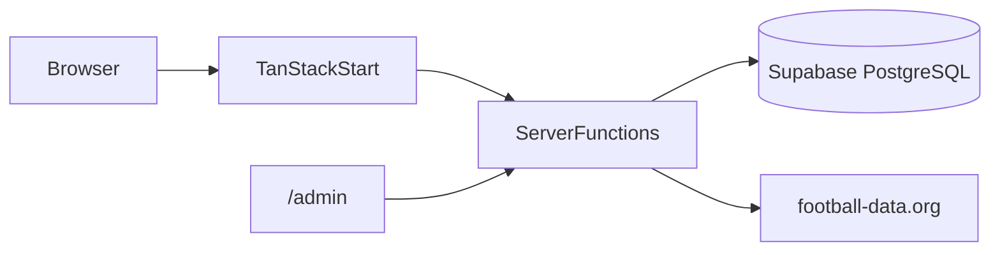

# Bolão Copa 2026

**Languages / Idiomas:** [Português (pt-BR)](#português-pt-br) · [English (en-US)](#english-en-us)

> **Arquitetura / Architecture**



---

## Português (pt-BR)

### Visão geral

**Bolão Copa 2026** é um bolão web para a Copa do Mundo FIFA 2026. Os participantes entram com e-mail (sem senha), fazem palpites nos jogos, acompanham o ranking em tempo real e disputam o topo da tabela. Um painel administrativo permite sincronizar jogos via API, gerenciar partidas e participantes, e exportar dados.

**Stack:** TanStack Start · React 19 · Vite 7 · Nitro · Supabase · Tailwind CSS 4

### Funcionalidades

| Rota              | Descrição                                                 |
| ----------------- | --------------------------------------------------------- |
| `/`               | Landing com estatísticas e chamada para participar        |
| `/participar`     | Cadastro e acesso por e-mail (sem senha)                  |
| `/palpites`       | Palpites do participante logado                           |
| `/ranking`        | Ranking geral com pódio top-3                             |
| `/lider`          | Perfil detalhado do líder atual                           |
| `/jogos`          | Lista de jogos com filtros por fase                       |
| `/jogos/:matchId` | Detalhes de um jogo específico                            |
| `/regras`         | Pontuação e critérios de desempate                        |
| `/admin`          | Sync com API, CRUD de jogos/participantes, exportação CSV |

### Regras de pontuação

| Pontos | Critério                         |
| ------ | -------------------------------- |
| **5**  | Placar exato                     |
| **3**  | Vencedor correto + saldo de gols |
| **1**  | Apenas o vencedor (ou empate)    |
| **0**  | Palpite incorreto                |

**Desempate:** (1) mais placares exatos → (2) mais resultados corretos → (3) mais palpites feitos → (4) ordem alfabética por nome.

Palpites podem ser editados até o apito inicial. O ranking é recalculado automaticamente quando os resultados são atualizados.

### Stack técnica

| Camada         | Tecnologias                                                                                                                                                               |
| -------------- | ------------------------------------------------------------------------------------------------------------------------------------------------------------------------- |
| Frontend / SSR | [TanStack Start](https://tanstack.com/start), [React 19](https://react.dev), [TanStack Router](https://tanstack.com/router), [TanStack Query](https://tanstack.com/query) |
| Build          | [Vite 7](https://vite.dev), [Nitro](https://nitro.build)                                                                                                                  |
| UI             | [Tailwind CSS 4](https://tailwindcss.com), [shadcn/ui](https://ui.shadcn.com), [Framer Motion](https://www.framer.com/motion/), [Lucide](https://lucide.dev)              |
| Backend        | [Supabase](https://supabase.com) (PostgreSQL, RLS) via Server Functions                                                                                                   |
| Validação      | [Zod](https://zod.dev)                                                                                                                                                    |
| Dados externos | [football-data.org](https://www.football-data.org/) (sync opcional de jogos da Copa)                                                                                      |
| Runtime        | [Bun](https://bun.sh) (recomendado)                                                                                                                                       |

### Pré-requisitos

- [Bun](https://bun.sh) (recomendado) ou Node.js 20+
- Projeto [Supabase](https://supabase.com) com as migrations aplicadas
- Token da [football-data.org](https://www.football-data.org/) — opcional; jogos podem ser cadastrados manualmente no `/admin`

### Configuração local

```bash
cd bolao-copa-2026
cp .env.example .env
# Preencha as variáveis no .env
bun install
bun run dev
```

O servidor de desenvolvimento inicia via Vite (porta padrão `5173`, salvo conflito).

### Variáveis de ambiente

Copie [`.env.example`](.env.example) para `.env` e preencha os valores. O arquivo `.env` está no [`.gitignore`](.gitignore) e **não deve ser commitado**.

| Variável                        | Onde é usada      | Descrição                                         |
| ------------------------------- | ----------------- | ------------------------------------------------- |
| `VITE_SUPABASE_URL`             | Cliente (browser) | URL do projeto Supabase                           |
| `VITE_SUPABASE_PUBLISHABLE_KEY` | Cliente (browser) | Chave anon/public do Supabase                     |
| `SUPABASE_URL`                  | Server Functions  | URL do projeto Supabase                           |
| `SUPABASE_PUBLISHABLE_KEY`      | Server Functions  | Chave anon/public do Supabase                     |
| `SUPABASE_SERVICE_ROLE_KEY`     | Server Functions  | Chave service role (bypass RLS — apenas servidor) |
| `FOOTBALL_DATA_TOKEN`           | Server Functions  | Token da API football-data.org para sync de jogos |

```env
# Cliente (Vite — expostas ao browser)
VITE_SUPABASE_URL=
VITE_SUPABASE_PUBLISHABLE_KEY=

# Servidor (Server Functions — nunca commitar)
SUPABASE_URL=
SUPABASE_PUBLISHABLE_KEY=
SUPABASE_SERVICE_ROLE_KEY=

# Sync de jogos (football-data.org)
FOOTBALL_DATA_TOKEN=
```

**Notas:**

- Variáveis `VITE_*` são injetadas no build do Vite e ficam acessíveis no browser — use apenas valores públicos.
- No servidor, `process.env` é lido dentro dos handlers (não no topo do módulo) para compatibilidade com ambientes serverless.
- `FOOTBALL_DATA_TOKEN` é necessário apenas para o botão de sync no `/admin`.

### Banco de dados

O schema PostgreSQL está em [`supabase/migrations/`](supabase/migrations/).

**Tabelas principais:**

| Tabela         | Descrição                                        |
| -------------- | ------------------------------------------------ |
| `participants` | Participantes (nome, e-mail, pontuação agregada) |
| `matches`      | Jogos da Copa (times, placar, fase, status)      |
| `predictions`  | Palpites por participante e jogo                 |
| `teams`        | Seleções e bandeiras                             |
| `settings`     | Configurações (ex.: hash do PIN admin)           |
| `sync_logs`    | Histórico de sincronizações com a API            |

A view `ranking_view` expõe o ranking com e-mail mascarado para exibição pública.

**Aplicar migrations** (com [Supabase CLI](https://supabase.com/docs/guides/cli) instalada):

```bash
supabase db push
```

### Scripts

| Comando           | Descrição                               |
| ----------------- | --------------------------------------- |
| `bun run dev`     | Servidor de desenvolvimento             |
| `bun run build`   | Build de produção (saída em `.output/`) |
| `bun run preview` | Preview local do build                  |
| `bun run lint`    | ESLint                                  |
| `bun run format`  | Prettier (formata todos os arquivos)    |

### Estrutura do projeto

```
bolao-copa-2026/
├── src/
│   ├── routes/              # Páginas (file-based routing — TanStack Start)
│   ├── lib/                 # Server Functions (*.functions.ts) e helpers server
│   ├── integrations/        # Cliente Supabase e middleware de auth
│   ├── components/          # UI (shadcn) e componentes de domínio
│   ├── hooks/               # Hooks React
│   ├── server.ts            # Entry SSR com tratamento de erros
│   └── styles.css           # Design tokens e utilitários Tailwind
├── supabase/
│   └── migrations/          # Schema PostgreSQL
├── public/                  # Assets estáticos
├── vite.config.ts           # TanStack Start + Nitro + Tailwind
├── package.json
└── bun.lock
```

Convenções de rotas TanStack: [`src/routes/README.md`](src/routes/README.md).

### Admin

Acesse `/admin` para o painel administrativo.

1. **Primeiro acesso:** defina um PIN admin (mínimo 4 caracteres). O hash é salvo na tabela `settings`.
2. **Acessos seguintes:** informe o PIN para desbloquear o painel. O PIN fica em `sessionStorage` (`bolao_admin_pin`) durante a sessão.
3. **Sync:** com `FOOTBALL_DATA_TOKEN` configurado, sincroniza jogos e times da Copa via football-data.org.
4. **Manual:** cadastre ou edite jogos, gerencie participantes e exporte ranking/palpites em CSV.

A rota `/admin` inclui `noindex,nofollow` para evitar indexação.

### Build e deploy

```bash
bun run build    # Gera .output/ via Nitro (preset node-server)
bun run preview  # Preview local do build
```

O build atual usa Nitro com preset `node-server`. Deploy em outros alvos (ex.: Cloudflare Workers) exige ajuste do preset Nitro no `vite.config.ts`.

### Repositório

Código-fonte: [github.com/Barbantti/bolao](https://github.com/Barbantti/bolao)

Projeto privado — uso interno.

---

## English (en-US)

### Overview

**Bolão Copa 2026** is a web-based pool for the FIFA World Cup 2026. Participants sign in with email (no password), submit match predictions, follow the live leaderboard, and compete for the top spot. An admin panel supports API sync, match and participant management, and data export.

**Stack:** TanStack Start · React 19 · Vite 7 · Nitro · Supabase · Tailwind CSS 4

### Features

| Route             | Description                                  |
| ----------------- | -------------------------------------------- |
| `/`               | Landing page with stats and join CTA         |
| `/participar`     | Sign-up and sign-in by email (no password)   |
| `/palpites`       | Logged-in participant's predictions          |
| `/ranking`        | Overall leaderboard with top-3 podium        |
| `/lider`          | Detailed profile of the current leader       |
| `/jogos`          | Match list with stage filters                |
| `/jogos/:matchId` | Single match details                         |
| `/regras`         | Scoring and tiebreaker rules                 |
| `/admin`          | API sync, match/participant CRUD, CSV export |

### Scoring rules

| Points | Criteria                         |
| ------ | -------------------------------- |
| **5**  | Exact score                      |
| **3**  | Correct winner + goal difference |
| **1**  | Correct winner (or draw) only    |
| **0**  | Incorrect prediction             |

**Tiebreakers:** (1) most exact scores → (2) most correct results → (3) most predictions submitted → (4) alphabetical by name.

Predictions can be edited until kickoff. The leaderboard is recalculated automatically when results are updated.

### Tech stack

| Layer          | Technologies                                                                                                                                                              |
| -------------- | ------------------------------------------------------------------------------------------------------------------------------------------------------------------------- |
| Frontend / SSR | [TanStack Start](https://tanstack.com/start), [React 19](https://react.dev), [TanStack Router](https://tanstack.com/router), [TanStack Query](https://tanstack.com/query) |
| Build          | [Vite 7](https://vite.dev), [Nitro](https://nitro.build)                                                                                                                  |
| UI             | [Tailwind CSS 4](https://tailwindcss.com), [shadcn/ui](https://ui.shadcn.com), [Framer Motion](https://www.framer.com/motion/), [Lucide](https://lucide.dev)              |
| Backend        | [Supabase](https://supabase.com) (PostgreSQL, RLS) via Server Functions                                                                                                   |
| Validation     | [Zod](https://zod.dev)                                                                                                                                                    |
| External data  | [football-data.org](https://www.football-data.org/) (optional World Cup match sync)                                                                                       |
| Runtime        | [Bun](https://bun.sh) (recommended)                                                                                                                                       |

### Prerequisites

- [Bun](https://bun.sh) (recommended) or Node.js 20+
- A [Supabase](https://supabase.com) project with migrations applied
- A [football-data.org](https://www.football-data.org/) API token — optional; matches can be entered manually in `/admin`

### Local setup

```bash
cd bolao-copa-2026
cp .env.example .env
# Fill in the variables in .env
bun install
bun run dev
```

The dev server runs via Vite (default port `5173` unless occupied).

### Environment variables

Copy [`.env.example`](.env.example) to `.env` and fill in the values. The `.env` file is listed in [`.gitignore`](.gitignore) and **must not be committed**.

| Variable                        | Used in          | Description                                   |
| ------------------------------- | ---------------- | --------------------------------------------- |
| `VITE_SUPABASE_URL`             | Client (browser) | Supabase project URL                          |
| `VITE_SUPABASE_PUBLISHABLE_KEY` | Client (browser) | Supabase anon/public key                      |
| `SUPABASE_URL`                  | Server Functions | Supabase project URL                          |
| `SUPABASE_PUBLISHABLE_KEY`      | Server Functions | Supabase anon/public key                      |
| `SUPABASE_SERVICE_ROLE_KEY`     | Server Functions | Service role key (bypasses RLS — server only) |
| `FOOTBALL_DATA_TOKEN`           | Server Functions | football-data.org API token for match sync    |

```env
# Client (Vite — exposed to the browser)
VITE_SUPABASE_URL=
VITE_SUPABASE_PUBLISHABLE_KEY=

# Server (Server Functions — never commit)
SUPABASE_URL=
SUPABASE_PUBLISHABLE_KEY=
SUPABASE_SERVICE_ROLE_KEY=

# Match sync (football-data.org)
FOOTBALL_DATA_TOKEN=
```

**Notes:**

- `VITE_*` variables are injected at Vite build time and are available in the browser — use public values only.
- On the server, read `process.env` inside handlers (not at module top level) for serverless compatibility.
- `FOOTBALL_DATA_TOKEN` is only required for the sync action in `/admin`.

### Database

The PostgreSQL schema lives in [`supabase/migrations/`](supabase/migrations/).

**Main tables:**

| Table          | Description                                     |
| -------------- | ----------------------------------------------- |
| `participants` | Participants (name, email, aggregated score)    |
| `matches`      | World Cup matches (teams, score, stage, status) |
| `predictions`  | Predictions per participant and match           |
| `teams`        | National teams and flag codes                   |
| `settings`     | App settings (e.g. admin PIN hash)              |
| `sync_logs`    | API sync history                                |

The `ranking_view` view exposes the leaderboard with masked emails for public display.

**Apply migrations** (with [Supabase CLI](https://supabase.com/docs/guides/cli)):

```bash
supabase db push
```

### Scripts

| Command           | Description                             |
| ----------------- | --------------------------------------- |
| `bun run dev`     | Development server                      |
| `bun run build`   | Production build (output in `.output/`) |
| `bun run preview` | Local preview of the build              |
| `bun run lint`    | ESLint                                  |
| `bun run format`  | Prettier (formats all files)            |

### Project structure

```
bolao-copa-2026/
├── src/
│   ├── routes/              # Pages (file-based routing — TanStack Start)
│   ├── lib/                 # Server Functions (*.functions.ts) and server helpers
│   ├── integrations/        # Supabase client and auth middleware
│   ├── components/          # UI (shadcn) and domain components
│   ├── hooks/               # React hooks
│   ├── server.ts            # SSR entry with error handling
│   └── styles.css           # Design tokens and Tailwind utilities
├── supabase/
│   └── migrations/          # PostgreSQL schema
├── public/                  # Static assets
├── vite.config.ts           # TanStack Start + Nitro + Tailwind
├── package.json
└── bun.lock
```

TanStack routing conventions: [`src/routes/README.md`](src/routes/README.md).

### Admin

Open `/admin` for the admin panel.

1. **First visit:** set an admin PIN (minimum 4 characters). The hash is stored in the `settings` table.
2. **Later visits:** enter the PIN to unlock the panel. The PIN is kept in `sessionStorage` (`bolao_admin_pin`) for the session.
3. **Sync:** with `FOOTBALL_DATA_TOKEN` set, sync World Cup matches and teams from football-data.org.
4. **Manual:** create or edit matches, manage participants, and export ranking/predictions as CSV.

The `/admin` route uses `noindex,nofollow` to avoid search indexing.

### Build and deploy

```bash
bun run build    # Outputs .output/ via Nitro (node-server preset)
bun run preview  # Local preview of the build
```

The current build uses Nitro with the `node-server` preset. Other targets (e.g. Cloudflare Workers) require adjusting the Nitro preset in `vite.config.ts`.

### Repository

Source: [github.com/Barbantti/bolao](https://github.com/Barbantti/bolao)

Private project — internal use.
